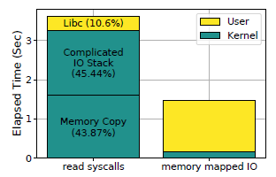
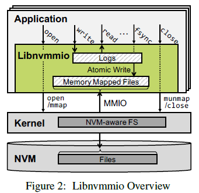
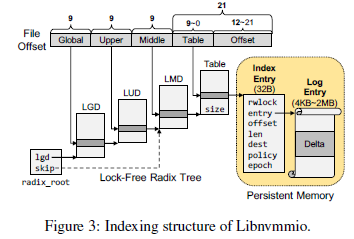
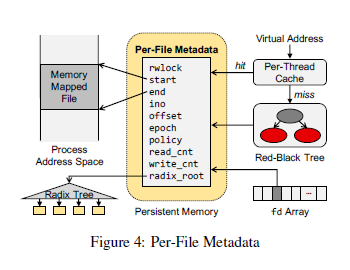
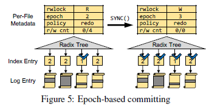

# 1. 背景
传统的文件系统限制了NVM的性能（software overhead）



# 2. 目的
充分发挥NVM的高性能

# 3. 存在的问题
1. 基于kernel的数据访问具有较高的延迟，**mmap io**提供直接NVM访问，能够有效减低kernel开销。

	> 减少了用户空间和page cache之间的数据交换  

2. mmap io不提供写数据的原子性，并且为了保证crash-safe，cache line应刷新以确保持久性，并应使用*内存隔离*以为NVM更新提供正确的持久顺序，这往往会带来大量开销，并且难以编程。

3. 现有的一致性保证机制中CoW存在写放大以及TLB-shootdown问题，journaling（logging）的两种方式有不同的适应场景。
	- redo log  
	先将数据写入redo log，再将log持久化到目标文件。redo log中记录最新的数据。（适合写）
	- undo log  
	先复制目标文件中的数据到undo log中，再对目标文件进行就地更新。目标文件中记录最新的数据。（适合读）  
	
	对于可按字节读写的NVM设备，混合日志可显著减少写放大。

# 4. libnvmmio
## 4.1. 设计目标和实现策略
* 低延时：避免使用内核IO路径。
* 原子性：使用日志维护数据操作原子性
* 高吞吐、高并发：灵活的数据结构、varying sizes and fine-grained logging。
* 以数据为中心，per-block的组织方式：基于inode的log对于同一文件的并发访问不友好。
* 对底层文件系统透明

## 4.2. Overall Architecture
Libnvmmio是一个运行在应用程序所在地址空间的文件库，并且依赖于底层的文件系统。Libnvmmio通过拦截IO请求并将其转换成对应的内存操作从而降低软件开销。需要注意的是，Libnvmmio只是对数据请求进行拦截，而对于元数据的操作请求则是直接交由内核处理。


### 4.2.1. **memory-mapped IO**
为了直接访问NVM。libnvmmio通过mmap建立文件映射，应分别用memcpy和non-temporal memcpy(MOVNT)来代替read和write方法。有如下两个好处。
* 当持久化和读取数据时，能够避免复杂的内核IO路径
* read/write操作涉及复杂的索引操作来定位物理块。而通过mmap io在建立映射后通过内存映射地址和偏移即可访问文件数据。而且也并不需要通过MMU和TLB完成到物理空间的映射，减少了大量的CPU开销。

### 4.2.2. **用户级logging**
即通过用户级日志记录来提供原子性。有以下两个优点。
* 粒度更小，即使极少量的数据写入也不会产生写放大。
* 不需要通过对TLB中的脏位来进行判断写回。

### 4.2.3. **应用透明**
即能够很容易的对使用write/read方法的应用程序进行修改。并且对于不需要保证原子性的IO操作提供了POSIX版本的memcpy。支持原子性的函数命名统一添加nv前缀（如nvmmap，nvmemcpy等）

## 4.3. Scalable Logging
Libnvmmio中的日志是以数据块为单位的（per-thread和per-transcaion的日志不利于线程间的数据共享）。在每次需要对文件数据进行更新时，通过需要更新的数据大小来决定log entry的大小（4KB~2MB），并且对所有线程可见。当其他线程需要读取更新处的数据时，直接读取对应的redo log即可。而per-thread的log机制，则需要统计所有线程的log来统计对同一数据块的更新，大大地提高了共享数据访问的性能。

而对于这种具有不同log size的log机制，Libnvmmio通过固定深度的radix tree来对索引进行组织，通过虚拟地址来对log entry进行索引。这种多级索引结构对于大量的log相较于索引表能够减少空间开销。
而且固定级数能够有效实现无锁机制，相较于平衡树能够提供更好的并行性。



index entry中部分成员解释
```
- entry： 指向对应的log entry
- offset： updated data在log entry中的起始偏移
- len：log entry中的有效数据
- policy：使用的log策略（redo、undo）
- dest：与offset一同记录的mmap file中对应的地址
- epoch：用于判断是否已被提交
```


上图展示了Libnnvmmio的索引结构。每一个内部节点都是指向下一级内部节点的桶阵列。文件偏移中（实为虚拟地址）的每9位用于在相应的内部节点定位bucket。每一个叶子节点对应一个索引条目（index entry），其有一个指向对应日志条目（log entry）的指针，并且还记录了一些log entry相关的数据，例如更新数据的偏移以及有效长度、读写锁等。

地址中的最后21位由于table以及index entry的索引。根据4KB~2MB的log entry大小，可以很容易地推断出两者的对应关系。如下表（最低位为第0位）。
| log size | bits for table | bits for index_entry |
| :------: | :------------: | :------------------: |
|   4KB    |     12-20      |         0-11         |
|   8KB    |     13-20      |         0-12         |
|   16KB   |     14-20      |         0-13         |
|   ...    |      ...       |         ...          |
|   1MB    |       20       |         0-19         |
|   2MB    |      nul       |         0-20         |

## 4.4. Epoch-based Background Checkpointing
Libnvmmio中的log entries通过显示调用SYNC来进行提交（以文件为单位）。被提交的entries需要被持久化到对应的文件中（称为checkpoint）。为了避免因在关键路径上进行checkpoint而导致性能的降低，Libnvmmi通过创建一个后台线程定期的判断并checkpoint已提交的日志条目。**在后台线程checkpoints时，并不需要获取整颗索引树的读写锁，只需要对相应的log entries进行上锁。**

当SYNC被显示调用时，libnvmmio需要将对应的logs转换成committed的状态。为了减少开销，Libnvmmio基于epoch来进行commit和checkpoint。

Libnvmmio包括两种类型的epoch：
- 由文件的元数据维护的global epoch number
- 由index entry维护的epoch number

每次申请一个新的index entry时，会将其epoch赋值为global epoch。在每次调用SYNC，将global epoch加1，此时并不一定回将对应的log entries写回，需要判断log policy是否改变（后文介绍）。这样，后台同步线程可以通过epoch来判断对应的log entries是否是已被提交的但是未checkpoint的。
> epoch < global epoch ------> committed
> 
> epoch = global epoch ------> uncommitted

## Per-File Metadata
Libnvmmio在PM中维护了两种元数据:
* index entry(metadata for log entry)
* uma(metadata for Per-File)



Per-File Metadata中的部分成员解释
```
start: mmap file的起始地址
end：mmap file的终止地址
epoch：global epoch
offset：映射文件的偏移
read_cnt：处理的读请求次数
radix_root：指向全局的radix root
```
当libnvmmio访问一个文件时，首先需要获取其元数据。Libnvmmio用红黑树来对uma进行组织，在查找时，通过判断虚拟地址是否包含在start-end中来进行查找。为了加快查找策略，Libnvmmio申请了一块静态数组来充当cache。查找uma时首先在cache中操作，如果查找不存在，再进入到红黑树中进行查找。在每次在红黑树中查找成功后，都需要将其哈希到静态数组中以加快下一次的查询。同时，Libnvmmio还支持通过文件描述符来快速的查找到对应的uma。（Libnvmmio维护了一个fd_table[]数组，记录了各种信息，包括对应的uma）


## 4.5. Hybrid Logging
Libnvmmio为了面对不同的读写密集情况，对不同的文件采用log policy（undo or redo）。
* 对于读密集的情况使用undo log
* 对于写密集的情况使用redo log

在每次对文件进行读写时，都需要将元数据中记录的read或者write次数加1。在进行SYNC时，通过判断read/write的值来判断是否需要改变日志策略。如果需要的话，则需要对相应的log entries进行checkpoint，保证此时该文件对应的log entries全部被释放，再修改log policy，这样，在下次申请index entries时，转而使用新的log policy。转换过程如下图。




# 代码分析
## 相关结构体定义
