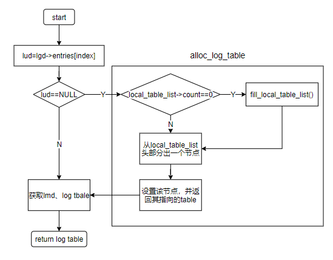
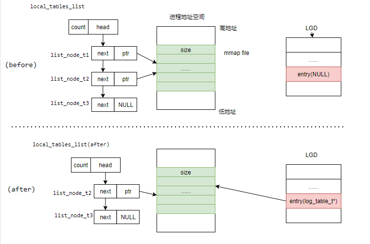
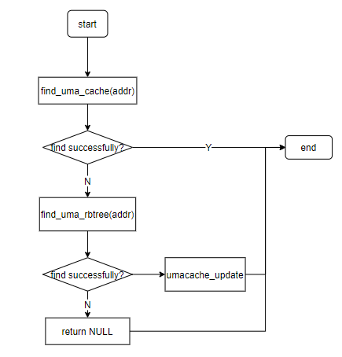
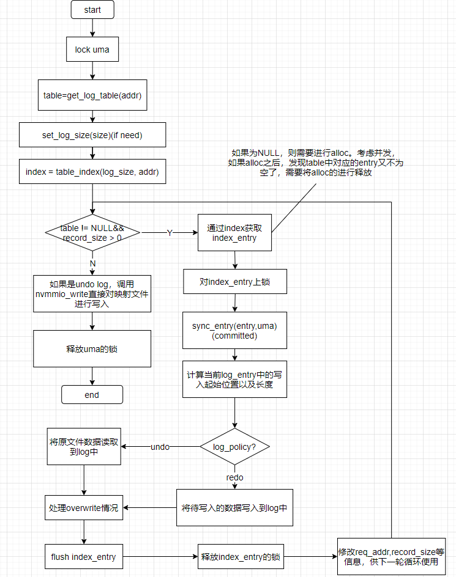
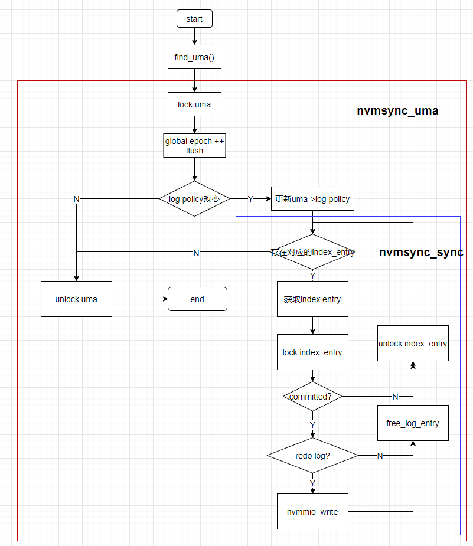

- [1. 背景](#1-背景)
- [2. 目的](#2-目的)
- [3. 存在的问题](#3-存在的问题)
- [4. libnvmmio](#4-libnvmmio)
  - [4.1. 设计目标和实现策略](#41-设计目标和实现策略)
  - [4.2. Overall Architecture](#42-overall-architecture)
    - [4.2.1. memory-mapped IO](#421-memory-mapped-io)
    - [4.2.2. 用户级logging](#422-用户级logging)
    - [4.2.3. 应用透明](#423-应用透明)
  - [4.3. Scalable Logging](#43-scalable-logging)
  - [4.4. Epoch-based Background Checkpointing](#44-epoch-based-background-checkpointing)
  - [4.5. Per-File Metadata](#45-per-file-metadata)
  - [4.6. Hybrid Logging](#46-hybrid-logging)
- [5. 代码分析](#5-代码分析)
  - [5.1. 数据结构](#51-数据结构)
  - [5.2. 空间分配](#52-空间分配)
    - [5.2.1. 全局空间链表](#521-全局空间链表)
    - [5.2.2. 本地空间链表](#522-本地空间链表)
    - [5.2.3. 空间申请与回收](#523-空间申请与回收)
  - [5.3. 元数据索引](#53-元数据索引)
    - [5.3.1. index entry](#531-index-entry)
    - [5.3.2. uma(Per-File Matedata)索引](#532-umaper-file-matedata索引)
  - [5.4. nv-prefix function](#54-nv-prefix-function)
    - [5.4.1. nvopen](#541-nvopen)
    - [5.4.2. nvwrite](#542-nvwrite)
    - [5.4.3. nvread](#543-nvread)
    - [5.4.4. msync](#544-msync)
    - [5.4.5. sync_backround](#545-sync_backround)
    - [5.4.6. 一些其他的函数](#546-一些其他的函数)
    - [5.4.7. 整个项目框架](#547-整个项目框架)
- [6. 其他](#6-其他)
# 1. 背景
传统的文件系统限制了NVM的性能（software overhead）


# 2. 目的
充分发挥NVM的高性能

# 3. 存在的问题
1. 基于kernel的数据访问具有较高的延迟，**mmap io**提供直接NVM访问，能够有效减低kernel开销。

	> 减少了用户空间和page cache之间的数据交换  

2. mmap io不提供写数据的原子性，并且为了保证crash-safe，cache line应刷新以确保持久性，并应使用*内存隔离*以为NVM更新提供正确的持久顺序，这往往会带来大量开销，并且难以编程。

3. 现有的一致性保证机制中CoW存在写放大以及TLB-shootdown问题，journaling（logging）的两种方式有不同的适应场景。
	- redo log  
	先将数据写入redo log，再将log持久化到目标文件。redo log中记录最新的数据。（适合写）
	- undo log  
	先复制目标文件中的数据到undo log中，再对目标文件进行就地更新。目标文件中记录最新的数据。（适合读）  
	
	对于可按字节读写的NVM设备，混合日志可显著减少写放大。

# 4. libnvmmio
## 4.1. 设计目标和实现策略
* 低延时：避免使用内核IO路径。
* 原子性：使用日志维护数据操作原子性
* 高吞吐、高并发：灵活的数据结构、varying sizes and fine-grained logging。
* 以数据为中心，per-block的组织方式：基于inode的log对于同一文件的并发访问不友好。
* 对底层文件系统透明

## 4.2. Overall Architecture
Libnvmmio是一个运行在应用程序所在地址空间的文件库，并且依赖于底层的文件系统。Libnvmmio通过拦截IO请求并将其转换成对应的内存操作从而降低软件开销。需要注意的是，Libnvmmio只是对数据请求进行拦截，而对于元数据的操作请求则是直接交由内核处理。


### 4.2.1. memory-mapped IO
为了直接访问NVM。libnvmmio通过mmap建立文件映射，应分别用memcpy和non-temporal memcpy(MOVNT)来代替read和write方法。有如下两个好处。
* 当持久化和读取数据时，能够避免复杂的内核IO路径
* read/write操作涉及复杂的索引操作来定位物理块。而通过mmap io在建立映射后通过内存映射地址和偏移即可访问文件数据。而且也并不需要通过MMU和TLB完成到物理空间的映射，减少了大量的CPU开销。

### 4.2.2. 用户级logging
即通过用户级日志记录来提供原子性。有以下两个优点。
* 粒度更小，即使极少量的数据写入也不会产生写放大。
* 不需要通过对TLB中的脏位来进行判断写回。

### 4.2.3. 应用透明
即能够很容易的对使用write/read方法的应用程序进行修改。并且对于不需要保证原子性的IO操作提供了POSIX版本的memcpy。支持原子性的函数命名统一添加nv前缀（如nvmmap，nvmemcpy等）

## 4.3. Scalable Logging
Libnvmmio中的日志是以数据块为单位的（per-thread和per-transcaion的日志不利于线程间的数据共享）。在每次需要对文件数据进行更新时，通过需要更新的数据大小来决定log entry的大小（4KB~2MB），并且对所有线程可见。当其他线程需要读取更新处的数据时，直接读取对应的redo log即可。而per-thread的log机制，则需要统计所有线程的log来统计对同一数据块的更新，大大地提高了共享数据访问的性能。

而对于这种具有不同log size的log机制，Libnvmmio通过固定深度的radix tree来对索引进行组织，通过虚拟地址来对log entry进行索引。这种多级索引结构对于大量的log相较于索引表能够减少空间开销。
而且固定级数能够有效实现无锁机制，相较于平衡树能够提供更好的并行性。


index entry中部分成员解释
```
- entry： 指向对应的log entry
- offset： updated data在log entry中的起始偏移
- len：log entry中的有效数据
- policy：使用的log策略（redo、undo）
- dest：与offset一同记录的mmap file中对应的地址
- epoch：用于判断是否已被提交
```


上图展示了Libnnvmmio的索引结构。每一个内部节点都是指向下一级内部节点的桶阵列。文件偏移中（实为虚拟地址）的每9位用于在相应的内部节点定位bucket。每一个叶子节点对应一个索引条目（index entry），其有一个指向对应日志条目（log entry）的指针，并且还记录了一些log entry相关的数据，例如更新数据的偏移以及有效长度、读写锁等。

地址中的最后21位由于table以及index entry的索引。根据4KB~2MB的log entry大小，可以很容易地推断出两者的对应关系。如下表（最低位为第0位）。
| log size | bits for table | bits for index_entry |
| :------: | :------------: | :------------------: |
|   4KB    |     12-20      |         0-11         |
|   8KB    |     13-20      |         0-12         |
|   16KB   |     14-20      |         0-13         |
|   ...    |      ...       |         ...          |
|   1MB    |       20       |         0-19         |
|   2MB    |      nul       |         0-20         |

## 4.4. Epoch-based Background Checkpointing
Libnvmmio中的log entries通过显示调用SYNC来进行提交（以文件为单位）。被提交的entries需要被持久化到对应的文件中（称为checkpoint）。为了避免因在关键路径上进行checkpoint而导致性能的降低，Libnvmmi通过创建一个后台线程定期的判断并checkpoint已提交的日志条目。**在后台线程checkpoints时，并不需要获取整颗索引树的读写锁，只需要对相应的log entries进行上锁。**

当SYNC被显示调用时，libnvmmio需要将对应的logs转换成committed的状态。为了减少开销，Libnvmmio基于epoch来进行commit和checkpoint。

Libnvmmio包括两种类型的epoch：
- 由文件的元数据维护的global epoch number
- 由index entry维护的epoch number

每次申请一个新的index entry时，会将其epoch赋值为global epoch。在每次调用SYNC，将global epoch加1，此时并不一定回将对应的log entries写回，需要判断log policy是否改变（后文介绍）。这样，后台同步线程可以通过epoch来判断对应的log entries是否是已被提交的但是未checkpoint的。
> epoch < global epoch ------> committed
> 
> epoch = global epoch ------> uncommitted

## 4.5. Per-File Metadata
Libnvmmio在PM中维护了两种元数据:
* index entry(metadata for log entry)
* uma(metadata for Per-File)


Per-File Metadata中的部分成员解释
```
start: mmap file的起始地址
end：mmap file的终止地址
epoch：global epoch
offset：映射文件的偏移
read_cnt：处理的读请求次数
radix_root：指向全局的radix root
```
当libnvmmio访问一个文件时，首先需要获取其元数据。Libnvmmio用红黑树来对uma进行组织，在查找时，通过判断虚拟地址是否包含在start-end中来进行查找。为了加快查找策略，Libnvmmio申请了一块静态数组来充当cache。查找uma时首先在cache中操作，如果查找不存在，再进入到红黑树中进行查找。在每次在红黑树中查找成功后，都需要将其哈希到静态数组中以加快下一次的查询。同时，Libnvmmio还支持通过文件描述符来快速的查找到对应的uma。（Libnvmmio维护了一个fd_table[]数组，记录了各种信息，包括对应的uma）


## 4.6. Hybrid Logging
Libnvmmio为了面对不同的读写密集情况，对不同的文件采用log policy（undo or redo）。
* 对于读密集的情况使用undo log
* 对于写密集的情况使用redo log

在每次对文件进行读写时，都需要将元数据中记录的read或者write次数加1。在进行SYNC时，通过判断read/write的值来判断是否需要改变日志策略。如果需要的话，则需要对相应的log entries进行checkpoint，保证此时该文件对应的log entries全部被释放，再修改log policy，这样，在下次申请index entries时，转而使用新的log policy。转换过程如下图。


# 5. 代码分析
## 5.1. 数据结构
**log_entry_struct**：索引条目结构（index entry），被持久化到PM上，对应文件`$pmem_path/.libnvmmio-$libnvmmio_pid/entries.log"`
```c
typedef struct log_entry_struct {
  union {
    struct {
      unsigned long united;
    };
    struct {
      unsigned long epoch : 20;	// 版本号
      unsigned long offset : 21; // 有效数据在log_entry中的偏移
      unsigned long len : 22; // 有效数据的长度
      unsigned long policy : 1; 
    };
  };
  void *data; // 指向log entry
  void *dst;  // 与offset一起指向写回到映射文件的地址
  pthread_rwlock_t *rwlockp;
} log_entry_t;
```

**uma_t**：Per-File Metadata，被持久化到PM上，对应文件`$pmem_path/.libnvmmio-$libnvmmio_pid/uma.log`
```c
typedef struct mmap_area_struct {
  unsigned long epoch;  // 全局版本号
  unsigned long policy; // 日志策略
  void *start;  // mmap file起始地址
  void *end;  // mmap file终止地址
  unsigned long ino; // inode
  off_t offset; // 一般为0，代表为文件起始处开始映射
  unsigned long read; // 处理读请求的数据
  unsigned long write;
  struct thread_info_struct *tinfo; // 未使用
  pthread_rwlock_t *rwlockp;
  struct rb_node rb;  // 在rbtree中的节点
  struct list_head list;// 同步线程链表中的元素(未使用)
  int id;
  pthread_t sync_thread; // 用于同步的后台线程
} uma_t;
```

**fd_mapaddr_struct**：记录文件相关的信息，以文件描述符为索引，利用该结构体数组可以通过fd快速查询到文件的相关信息，例如文件的元数据信息uma。
```c
/**
 * @brief 记录文件相关的数据
 * 
 */
typedef struct fd_mapaddr_struct {
  void *addr; // 记录映射起始地址
  off_t off;  // 文件内偏移
  char pathname[PATH_SIZE];
  size_t mapped_size; // 映射空间的大小，一般不变，用于unmap时的参数
  size_t written_file_size; // 映射文件的有效数据长度
  size_t current_file_size; // 文件在nvm上的大小
  int dup; // 记录复制的文件描述符次数
  int dupfd;  // 指示当前的fd是否是dup来的。如果fd_table[fd].dupfd != fd.则说明通过调用nvdup产生的fd。
  int open; // 文件被打开的次数，即打开同一文件产生的不同的文件描述符的个数（不包括dup）
  int increaseCount;  // 文件在nvm上空间扩展的次数，初始值为1
  uma_t *fd_uma;
} fd_addr;
```

**log_table_struct**: 索引树radix tree中的节点结构。
```c
/**
 * @brief radix tree的内部节点
 * 
 * @param count 具有的子节点树
 * @param type LGD、LUD、LMD前三层。TABLE：存放index entry的table层
 * @param log_size 指向的log entry的大小
 * @param index 在上一级桶阵列的index
 * @param entries 指向的index entries或者下一级桶阵列
 * 
 */
typedef struct log_table_struct {
  int count; 
  log_size_t log_size;
  enum table_type_enum type;
  struct log_table_struct *parent;
  int index;
  void *entries[PTRS_PER_TABLE];
} log_table_t;
```
需要注意的是，radix tree的构建并不是一步到位的，而是每次需要访问到对应的桶阵列（table）时，才从已申请空间的global_table_list中分配。只有当`TYPE == TABLE`，成员log_size才有意义，其他情况下为4K。

## 5.2. 空间分配
相关代码位于[alloctor.c](src/allocator.c)
### 5.2.1. 全局空间链表
```c
static freelist_t *global_tables_list = NULL;/* 指向table空间的链表指针 */
static freelist_t *global_entries_list = NULL; /* 指向index entries空间的指针链表指针 */
static freelist_t *global_data_list[NR_LOG_SIZES] = {NULL, }; /* 指向log entries空间的链表指针数组 */
static freelist_t *global_uma_list = NULL;/* 指向uma空间的链表指针 */
```
在每次调用`open`函数打开一个文件时，都会继续初始化检查。调用`init_libnvmmio`以初始化，函数框架如下：
```html
|-- init_libnvmmio
    |-- init_env() 设置pmem_path
    |-- init_global_freelist 申请空间
        |-- create_global_tables_list 申请
        |-- create_global_entries_list
        |-- create_global_data_list
        |-- create_global_umas_list
    |-- init_radixlog 初始化radix tree
    |-- init_uma  
    |-- init_base_address
```
所有global_list的类型都为`freelist_struct`，结构如下：
```c
typedef struct freelist_struct {
  list_node_t *head;  // 指向链表头
  unsigned long count;  // 链表节点个数
  pthread_mutex_t mutex; 
} freelist_t;
```
以`create_global_tables_list`为例，由于table（radix树中的桶阵列）不需要持久化到PM上，于是首先创建一个匿名映射（对于`global_entries_list`而言，则是先在PM上创建文件并申请相应的空间，然后再建立映射），然后调用`create_list`创建链表。
```c
for (i = 0; i < count; i++) {
    node = alloc_list_node();
    node->ptr = address + (i * size);// 指向mmap file中对应的位置
    node->next = head;
    head = node;

    if (tail && *tail == NULL) {
      *tail = node;
    }
  }
```
在创建链表时，首先申请一个链表节点（`list_node_t`）空间，根据传入的size来确定该节点指向的映射空间起始地址，同时将该节点从链表头插入。


### 5.2.2. 本地空间链表
```c
static __thread freelist_t *local_tables_list = NULL;
static __thread freelist_t *local_entries_list = NULL;
static __thread freelist_t *local_data_list[NR_LOG_SIZES] = {NULL, };
```
本地空间链表构造上与global_list一致，在每次申请空间时，首先从对应的local_list中获取，当local_list为空时，则先用global_list中的节点进行填充，再从local_list中进行获取。

### 5.2.3. 空间申请与回收
下面用实例来说明空间的申请和回收操作。考虑radix_tree中的索引过程，通过虚拟地址address索引到对应的index entry所在的table，该功能有函数`get_log_table`实现。部分代码片段如下：
```c
log_table_t *get_log_table(unsigned long address) {
  log_table_t *lud, *lmd, *table;
  unsigned long index;
  /* LUD */
  index = lgd_index(address);
  lud = lgd->entries[index];

  if (lud == NULL) {
    lud = alloc_log_table(lgd, index, LUD);

    if (!__sync_bool_compare_and_swap(&lgd->entries[index], NULL, lud)) {
      // free(lud);
      lud = lgd->entries[index];
    }
  }
  /* 获得 lmd、Log Table */
  // ···
  return table;
}
```
流程如下：
1. 利用address中对应的LGD bits来获得对应的LMD桶阵列。
2. 如果获得的lud为空，执行`alloc_log_table`
   1. 判断`fill_local_tables_list`中是否有剩余节点
   2. 若有，则释放该节点，并返回该节点指向的table，结束。
   3. 若无，调用`fill_local_tables_list`，用global_tables_list对其进行填充。
3. 利用原子操作，将申请的table赋值到lgd中。
4. 执行上述流程获取LMD和log table，并返回log table

流程图如下：



过程示意图如下：



当global_tables_list中的剩余节点的个数小于一个阈值（`MAX_FREE_NODES`=2048，首次创建global_tables_list时的个数为10*`MAX_FRE_NODES`）时，会触发一个后台线程，执行fill_global_tables_list进行填充。
其他例如index entries（entries_list）、log entries（data_list）的空间分配也是与此类似。
TODO：空间回收流程
关于回收，entries和data空间会回收到链中，但是table貌似没有回收的概念。

## 5.3. 元数据索引
### 5.3.1. index entry
这一部分介绍index entry的索引实现。
1. LDG、LUD和LMD中的索引方式
```c
static inline unsigned long lgd_index(unsigned long address) {
  return (address >> LGD_SHIFT) & (PTRS_PER_TABLE - 1);
}

static inline unsigned long lud_index(unsigned long address) {
  return (address >> LUD_SHIFT) & (PTRS_PER_TABLE - 1);
}

static inline unsigned long lmd_index(unsigned long address) {
  return (address >> LMD_SHIFT) & (PTRS_PER_TABLE - 1);
}
```
`lgd_index`、`lud_index`和`lmd_index`分别获取虚拟地址中用于在LDG、LUD和LMD中的索引地址。一些宏的定义如下表。
|     macro      | define |
| :------------: | :----: |
|   LGD_SHIFT    |   39   |
|   LUD_SHIFT    |   30   |
|   LMD_SHIFT    |   21   |
| PTRS_PER_TABLE |  1<<9  |
2. Table和Log entry的索引方式
这一部分需要根据log_size来判断address最后21位中的索引功能。在初始化table的时候，Libnvmmio会通过`set_log_size`函数将log_size设置为最小的大于record_size（写入数据长度）的2的整数倍值（不小于4K）。
假设log_size = 2^k。则最低k bits是用于在log_entries中的偏移，剩下的位index entry在table中的偏移。
```c
inline unsigned long table_index(log_size_t log_size, unsigned long address) {
  return (address >> LOG_SHIFT(log_size)) & (NUM_ENTRIES(log_size) - 1);
}
```
`LOG_SHIFT`的宏定义为
```c
#define LOG_SHIFT(s) (LMD_SHIFT - ((LMD_SHIFT - PAGE_SHIFT) - s))
```
实现的功能即计算第k~21比特的值，也即index entry在table中的索引。

### 5.3.2. uma(Per-File Matedata)索引
这一部分介绍uma的索引方式。
前文介绍了uma是通过rbtree组织的，并用一个静态数据（大小为8）充当cache。判断一个虚拟地址是否对应着uma的逻辑如下：
```c
uma->start <= addr && addr < uma->end // addr和uma两者对应
```
查找流程图如下：



## 5.4. nv-prefix function
这一部分将介绍主要的读写流程和同步操作，一起Libnvmmio提供的一些其他mmap io操作。
### 5.4.1. nvopen
```c
/**
 * @brief 打开一个文件，并且建立映射，可以通过flags来设置是否选择普通打开
 * @param path 路径
 * @param flags 
 * @param ... 
 * @return int 
 */
int nvopen(const char *path, int flags, ...)
```
在调用`nvopen`函数时可以通过参数flags来决定是否使用user-level mmap io。`nvopen`会在打开文件之后建立映射，并且用相关的信息存入到`fd_table[fd]`中，包括当前文件偏移量、映射文件大小以及映射文件地址等。在建立映射前，会先对文件进行扩展，方便映射后进行写入。
建立映射的函数位`nvmmap`，定义如下：
```c
/**
 * @brief 建立文件映射，并且记录uma
 * 
 * @param offset 一般设置为0，代表为文件起始处开始映射
 */
void *nvmmap(void *addr, size_t len, int prot, int flags, int fd, off_t offset)
```
函数实现的功能包括：
1. 调用`init_libnvmmio`进行初始化。
2. 调用`mmap`建立映射
3. 申请uma空间，并赋值。epoch为1，log polic初始采用redo log
4. 调用`create_sync_thread`创建一个后台线程，定期执行`sync_uma`函数，用于后台同步该文件。
5. 将该uma插入到rbtree以及umacache中。
### 5.4.2. nvwrite
```c
/**
 * @brief 将buf缓冲区中的cnt字节的数据写入到对应文件中
 * 
 * @param fd 文件描述符
 * @param buf 待写入的数据
 * @param cnt 待写入的数据长度
 * @return ssize_t 
 */
ssize_t nvwrite(int fd, const void *buf, size_t cnt)
```

`nvwrite(fd, buf, cnt)`:写操作的入口，流程如下
1. get_fd_addr_cur(fd)获得dst
2. pwriteToMap(fd, buf, cnt, dst)
   1. 通过fd获取uma信息
   2. 若空间不足，则进行重映射并expand。
      1. 扩展文件大小（PM空间）
      2. 调用`nvmsync`
      3. munmap uma：从rbtree中删除该uma的信息
      4. 调用`nvmmap`
      5. 修改`fd_table`中的信息并返回uma
   3. 写请求次数加一
   4. 调用`nvmemcpy_write`
3. 更新静态数组fd_table中对应的信息，包括offset、written_file_size和fd_uma等。
```c
/**
 * @brief 处理写请求
 * 
 * @param dst 写入的目标地址
 * @param src 待写入数据地址
 * @param record_size 写入数据大小
 * @param uma 文件元数据信息
 */
void nvmemcpy_write(void *dst, const void *src, size_t record_size, uma_t *uma)
```
`nvmemcpy_write(dst, buf, cnt, dst_uma)`：将数据写入到log entry中
1. 对uma上锁
2. 获取对应的Table（从`local_tables_list`中获取）
3. 根据写入内容的大小设置`log_size`(`log_entry`的大小)
4. 获得entry在table中的索引
   1. 从table中索引对应的index entry（若为`NULL`，从`local_entries_list`中申请，其中包括对log entry的空间申请，从`local_data_list`中获取）
   2. 对index entry上锁
   3. 若是已经commit，则调用`sync_entry`
   4. 根据log policy执行写入操作`nvmmio_write`
      * 如果是redo log，直接将数据写入log中。
      * 如果是unde log，复制一份元数据到log中，之后在文件上就地更新。
   5. 处理overwrite。这一部分的逻辑主要是将pre_log和刚写的log中间的空白进行填充，以保证entry中数据的连续性，并能够通过`index_entry`中的offset和len记录有效数据。
   6. 记录index_entry中的offset、len和dst。
   7. 持久化index_entry，调用`nvmmio_flush`（先flush后fence）。
5. 如果是undo log，则就地更新。

nvmemcpy_write的流程图如下所示：


`sync_entry`:
```c
/**
 * @brief 对提交的log entry进行写入，需要根据
 * 
 * @param entry 
 * @param uma 
 */
static void sync_entry(log_entry_t *entry, uma_t *uma) {
  void *dst, *src;

  if (entry->policy == REDO) {// 如果是redo log，写回到映射文件中
    dst = entry->dst + entry->offset; 
    src = entry->data + entry->offset;
    nvmmio_write(dst, src, entry->len, true);
  }
  entry->epoch = uma->epoch;
  entry->policy = uma->policy;
  entry->len = 0;
  entry->offset = 0;
  nvmmio_flush(entry, sizeof(log_entry_t), true);/* 持久化到PM */
}
```

`nvmmio_write`:真正执行数据写入，调用pmdk中的方法进行写入。
```c
/**
 * @brief 将src处的数据写入到PM中，dest是对应的映射地址
 */
static inline void nvmmio_write(void *dest, const void *src, size_t n,
                                bool fence) {
  LIBNVMMIO_INIT_TIME(nvmmio_write_time);
  LIBNVMMIO_START_TIME(nvmmio_write_t, nvmmio_write_time);

  pmem_memcpy_nodrain(dest, src, n);/* 从内存向PM拷贝数据，不经过cache，所以不需要flush，只需要fense */

  if (fence) {
    nvmmio_fence();
  }

  LIBNVMMIO_END_TIME(nvmmio_write_t, nvmmio_write_time);
}
```

`nvmmio_flush`:
```c
/**
 * @brief 调用pmem_flush
 */
static inline void nvmmio_flush(const void *addr, size_t n, bool flush) {
  LIBNVMMIO_INIT_TIME(nvmmio_flush_time);
  LIBNVMMIO_START_TIME(nvmmio_flush_t, nvmmio_flush_time);

  pmem_flush(addr, n);

  if (flush) {
    nvmmio_fence();
  }

  LIBNVMMIO_END_TIME(nvmmio_flush_t, nvmmio_flush_time);
}
```
### 5.4.3. nvread
read操作相对简单，操作流程如下：
**nvread(int fd, void *buf, size_t cnt)**
   1. `get_fd_addr_cur()`获得src
   2. 判断是否是mapped fd
   3. 通过`preadFromMap()`读取数据
      1. 通过fd获取uma。
      2. read次数加1。
      3. 根据log类型进行数据读取
         - UNDO： 直接调用`nvmmio_memcpy`，对映射地址进行读取，能完全读取
         - REDO：调用`nvmemcpy_read_redo`
           - 利用循环对addr对应的所有log_entry中的数据进行读取。不过因为不一定有进行修改，所以收redo log中的数据并不一定完全覆盖读取请求，所有是很有可能发生读取缺失的。不过代码并未再从映射地址进行读取。
   4. 修改fd_table记录的文件偏移off。
### 5.4.4. msync
Libnvmmio提供函数`nvmsync`，函数实现如下：
```c
/**
 * @brief SYNC
 */
int nvmsync(void *addr, size_t len, int flags) {
  uma_t *uma;

  len = (len + (~PAGE_MASK)) & PAGE_MASK;
  uma = find_uma(addr);
  if (__glibc_unlikely(uma == NULL)) {
    handle_error("find_uma() failed");
  }

	return nvmsync_uma(addr, len, flags, uma);
}
```
该函数将显式的将指定地址处的指定长度数据对应的log文件写回。主要实现通过addr查找到对应的uma，再调用`nvmsync_uma`来实现同步。

`nvmsync_uma`函数功能：每次sync，全局版本号epoch加1，刷写uma->epoch（Libnvmmio并为对uma中的其他成员进行刷写），并根据write/read的比例来判断是否需要修改log policy，如果log policy改变，则调用`nvmsync_sync`将该文件对应的所有log entries进行写回。如果log policy没有发生改变，则直接返回，已经committed的log entries将在后台被写回或者在下一次write时写回。
函数原型如下：
```c
/**
 * @brief msync，刷写uma->epoch，并调用nvmsync_sync持久化文件
 * 
 * @param addr 内存映射文件地址
 * @param len 内存映射文件大小
 * @param flags 
 * @param uma 
 * @return int 
 */
int nvmsync_uma(void *addr, size_t len, int flags, uma_t *uma)
```
`sync_uma`函数流程如下：
1. 对uma上锁。
2. 全局epoch加1
3. flush uma，只是flush uma->epoch. 
4. 更新log policy，如果策略不变则直接返回，后台进行sync
5. 调用**`nvmsync_sync`**同步log entries。

**`nvmsync_sync`**真正实现将log entries中的有效数据写回。
函数原型及解释如下：
```c
/**
 * @brief 将地址addr处开始的len字节数据对应的log entries进行写回。
 * 
 * nvmsync_sync <- nvmsync_uma <- nvmsync
 * 
 * @param addr 内存映射文件地址
 * @param len 内存映射文件大小
 * @param new_epoch 新的global epoch的值
 */
static void nvmsync_sync(void *addr, size_t len, unsigned long new_epoch)
```
函数主要工作流程如下：
1. 根据address获得映射的table以及对应的第一个entry（一个文件获取对应多个entry甚至跨table）。
2. 判断该entry是否已被committed，并且进行上锁。
3. 判断log policy，如果redo log，将log entries中的有效数据写回（`nvmmio_write`）。
4. 回收index_entry，log_entry的空间，并且table中的index entry计数减1。
5. 进行新一轮的循环，直到所有对应的log entries都已全部写回。
整个*MSYNC*操作的实现流程图如下：



### 5.4.5. sync_backround
在建立映射`nvmmap`时，会在结束前调用`create_ysnc_thread`函数，创建一个后台线程，该线程执行的函数会每过一段时间调用`sync_uma`函数来同步整个文件。`sync_uma`的逻辑有`nvmsync_sync`类似。不同之处在于，前者是对整个文件进行同步，而后者可以通过参数决定起始地址和数据长度。
```c
/**
 * @brief 后台同步线程执行函数
 */
static void *sync_thread_func(void *parm) {
  uma_t *uma;
  uma = (uma_t *)parm;

  LIBNVMMIO_DEBUG("%d uma thread start on %d", uma->id, sched_getcpu());

  while (true) {
    usleep(SYNC_PERIOD);
    sync_uma(uma);
  }
  return NULL;
}
```
### 5.4.6. 一些其他的函数
Libnvmmio针对于其他的内存操作也提供相关的函数，比如nvmemset，nvmemcpy，具体的实现都是先通过读取映射文件中的内容到内存中，然后在调用相关的内存操作函数（memset、memcpy）。

此外，

### 5.4.7. 整个项目框架
```html
|-- LIBNVMMIO
    |-- examples 一些使用示例
    |-- include
        |-- libnvmmio.h
    |-- src
        |-- allocator.c 映射空间管理和分配
        |-- allocator.h
        |-- debug.c 一些输出信息函数
        |-- debug.h
        |-- internal.h  宏定义
        |-- list.h 定义uma中用来组织同步线程的链表，实际并无意义
        |-- Makefile
        |-- nvmmio.c  文件操作的底层实现mmap io
        |-- nvmmio.h
        |-- nvrw.c  文件io
        |-- nvrw.h
        |-- radixlog.c index组织结构
        |-- radixlog.h 
        |-- rbtree.c  文件元数据的组织结构
        |-- rbtree.h
        |-- uma.c 文件元数据相关操作
        |-- uma.h
        |-- libnvmmio.md 本文件
        |-- README.md

```

# 6. 其他

1. 一些比较细的东西并没有加进去，包括fd_table[]中的一些成员的意义，以及fd_indirection[fd]。
2. sync时，并不会flush index_entry。只有在write的时候sync_entry中会flush index entry。